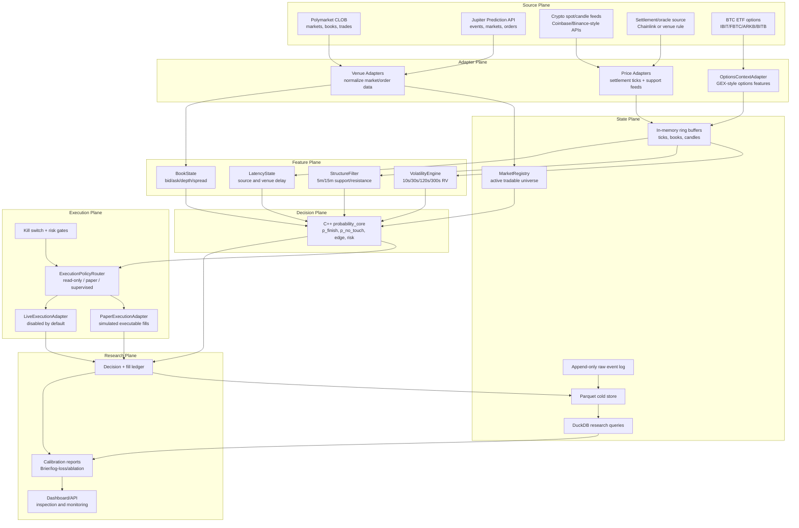
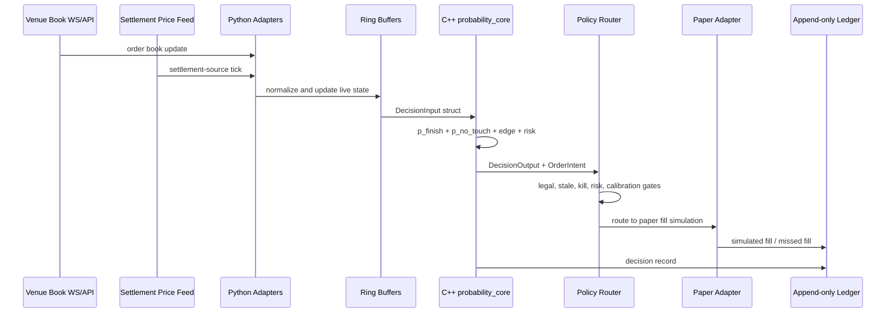
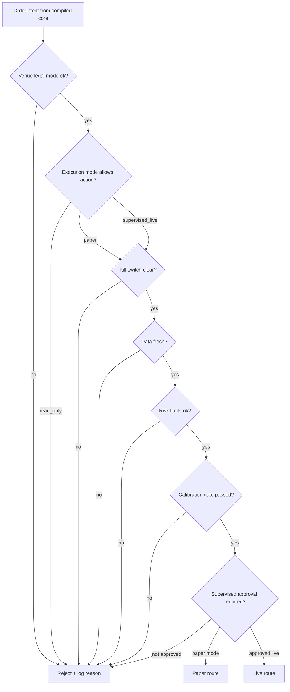

# Polymarket Complete Plan

Date: 2026-05-28

Project: multi-venue crypto binary pricing, paper-trading, and research system.

Working repository: `git@github.com:AnimeWeeb9000/polymarket.git`

This is the canonical plan for the project. The older files in `docs/` are
source notes and research backup. If a source note conflicts with this file,
this file wins unless Enoch changes it.

## 1. Project Thesis

The goal is not to predict crypto spot prices in general.

The goal is to price short-dated crypto binary contracts better than the venue
at specific moments.

For each BTC, ETH, or SOL 5-minute or 15-minute up/down market, the system
estimates:

- `p_finish`: probability the final settlement price ends on the desired side;
- `p_no_touch`: probability price does not cross back through the danger line
  before expiry;
- `z_path`: distance from the threshold divided by expected remaining move;
- `fair_price`: model-implied binary fair value;
- `edge`: fair value minus executable bid/ask, fees, slippage, stale-data
  buffer, and fill uncertainty.

The core thesis:

> The edge is fast, disciplined pricing of remaining path risk when a venue's
> executable price still implies too much reversal risk.

This is a derivatives-pricing and calibration project first. It is not a
"trade every green signal" bot.

## 2. What Is In Scope

Initial in-scope markets:

- BTC 5-minute up/down binaries;
- BTC 15-minute up/down binaries;
- ETH 5-minute up/down binaries;
- ETH 15-minute up/down binaries;
- SOL only after BTC/ETH plumbing is stable.

Initial in-scope venues:

- Polymarket-style CLOB markets;
- Jupiter Prediction Markets;
- other DeFi or regulated prediction venues only after their API, fee model,
  settlement rule, legal access, and execution mechanics are understood.

Initial in-scope modes:

- read-only market monitoring;
- paper trading;
- research reports;
- basic local UI;
- supervised-live shell only as a disabled architecture boundary.

Out of scope until explicitly added:

- fully autonomous live trading;
- custody automation;
- unsupervised market making;
- paid data-feed commitments;
- direct use of ETF options flow as an order trigger;
- scraping when an official API exists.

## 3. Research Verdict

This project is worth doing as a serious research system.

The strongest ideas:

- prediction markets are useful but imperfect probability signals;
- short-dated crypto binaries can be treated like cash-or-nothing digital
  options;
- remaining-path and no-touch probability are the right math family;
- realized volatility over multiple horizons is a defensible input;
- executable bid/ask comparison matters more than midpoint comparison;
- market making requires adverse-selection and stale-quote controls.

The plausible but unproven ideas:

- support/resistance as a blocking filter;
- BTC ETF options orderflow as contextual signal;
- short-horizon edge after all costs and latency penalties;
- maker quoting in thin prediction-market books.

The project should pivot or stop if research shows:

1. The model has worse Brier score or log loss than venue executable prices.
2. Apparent edge exists only against midpoint, not executable bid/ask.
3. Edge disappears after fees, spread, slippage, and stale-feed penalties.
4. `p_no_touch` is badly miscalibrated near final resolution.
5. The support/resistance filter removes winners and keeps losers.
6. ETF options context adds no out-of-sample calibration improvement.
7. Venue latency is too unstable to cancel/reprice safely.

## 4. Research Sources Behind The Design

Prediction-market probability:

- Wolfers and Zitzewitz, "Prediction Markets," Journal of Economic
  Perspectives, 2004.
- Wolfers and Zitzewitz, "Interpreting Prediction Market Prices as
  Probabilities," NBER, 2006.
- Manski, "Interpreting the Predictions of Prediction Markets."
- Page and Clemen, "Do Prediction Markets Produce Well-Calibrated Probability
  Forecasts?"

Crypto prediction markets as derivatives:

- Lee, Lee, and Lee, "Cryptocurrency Prediction Markets through the Derivatives
  Lens: Evidence from Kalshi and Polymarket," SSRN, 2026.
- Fabi, Schonleber, Ruffo, and Marfe, "Market Efficiency in Prediction Markets:
  A Comparison with Derivatives," SSRN, 2026.

Prediction-market microstructure:

- Dubach, "The Anatomy of a Decentralized Prediction Market: Microstructure
  Evidence from the Polymarket Order Book," arXiv, 2026.

Barrier/no-touch math:

- Reiner and Rubinstein, "Breaking Down the Barriers," Risk, 1991.
- Reflection-principle and barrier-option literature.

Realized volatility:

- Andersen, Bollerslev, Diebold, and Labys, "Modeling and Forecasting Realized
  Volatility," Econometrica, 2003.
- Corsi, "A Simple Approximate Long-Memory Model of Realized Volatility,"
  Journal of Financial Econometrics, 2009.
- Barndorff-Nielsen and Shephard on realized volatility.

Market making and adverse selection:

- Glosten and Milgrom, "Bid, Ask, and Transaction Prices in a Specialist
  Market," Journal of Financial Economics, 1985.
- Avellaneda and Stoikov, "High-frequency trading in a limit order book,"
  Quantitative Finance, 2008.
- Cont, Stoikov, and Talreja, "A Stochastic Model for Order Book Dynamics."

Technical structure filter:

- Lo, Mamaysky, and Wang, "Foundations of Technical Analysis," Journal of
  Finance, 2000.
- Brock, Lakonishok, and LeBaron, "Simple Technical Trading Rules and the
  Stochastic Properties of Stock Returns," Journal of Finance, 1992.

Options-flow context:

- Easley, O'Hara, and Srinivas, "Option Volume and Stock Prices."
- Pan and Poteshman, "The Information in Option Volume for Future Stock Prices."
- Johnson and So, "The Option to Stock Volume Ratio and Future Returns."
- Alexander, Deng, Feng, and Wan, "Net buying pressure and the information in
  bitcoin option trades."
- Nasdaq reporting on IBIT options liquidity after launch.

## 5. Design Principles

### 5.1 Price The Contract, Not The Coin

The system does not ask, "Will BTC go up?"

It asks:

- What exact contract is tradable?
- What threshold resolves it?
- What price source resolves it?
- How much time remains?
- How far is the current settlement-source price from the threshold?
- How much can the underlying normally move in the remaining time?
- What is the terminal win probability?
- What is the path survival probability?
- What is the executable venue price after costs?

Why this exists:

Short-dated binaries are narrow instruments. A general BTC forecast is too
broad. The tradable object is one outcome, one settlement rule, one expiry, and
one venue order book.

### 5.2 Keep Venue Differences Out Of The Math

Polymarket, Jupiter, Kalshi-through-Jupiter, and future DeFi venues expose
different APIs and order workflows.

The probability core should not know any venue-specific fields. It receives a
normalized internal contract and normalized market state.

This lets the project add venues without rewriting the model.

### 5.3 Build For Speed, But Measure The Real Bottlenecks

Use a compiled core for local hot calculations, but do not pretend C++ solves
network latency.

Most latency will come from:

- WebSocket delivery;
- settlement/oracle feed delay;
- venue book update delay;
- matching-engine delay;
- wallet signing and transaction submission for DeFi venues;
- cancel/reprice round trips;
- queue position uncertainty.

The local hot path should be fast, but the system also needs telemetry around
external delay.

### 5.4 Paper Trading Must Match Live Shape

Paper mode is not a separate toy path.

The compiled core emits the same `OrderIntent` whether execution mode is
read-only, paper, or supervised live. A policy router decides where the intent
goes.

This prevents paper results from lying about what live mode would have done.

### 5.5 ETF Options Flow Is Context, Not A Trigger

BTC ETF options may help classify volatility, skew, and risk appetite, but this
must be tested.

The ETF lane starts as research context:

- collect;
- normalize;
- quality-flag;
- join to binary windows;
- run ablation reports;
- promote only if it improves out-of-sample calibration.

## 6. Full System Map



## 7. Core Data Flow

### Step 1: Discover Candidate Markets

Venue adapters poll or subscribe to supported venues and normalize raw event
data into internal `MarketRecord` objects.

The market registry filters candidates by:

- asset: BTC, ETH, SOL;
- horizon: 5m or 15m;
- status: open and tradeable;
- settlement rule understood;
- threshold/start price known;
- expiry time known;
- venue mode allowed by config.

Why this exists:

The system should never price a market whose settlement mechanics are unknown.
Bad metadata is a silent account killer.

### Step 2: Track Settlement-Source Price

The price layer tracks the source that resolves the contract, not just generic
spot.

Possible sources:

- venue-defined oracle;
- Chainlink or other on-chain oracle;
- Jupiter/venue-specific oracle;
- exchange index if the venue resolves from one;
- fallback spot feeds for research only.

Why this exists:

If the contract resolves on one feed and the model uses another, the model can
be right about BTC and wrong about the contract.

### Step 3: Track Venue Order Books

Venue adapters maintain normalized order book snapshots:

- best bid;
- best ask;
- spread;
- visible depth;
- recent book changes;
- timestamp;
- source latency;
- venue latency;
- fee schedule.

Why this exists:

Only executable price matters. Midpoint edge is just a pretty hallucination with
a decimal point.

### Step 4: Maintain Rolling Feature State

The state layer keeps ring buffers for:

- settlement ticks;
- spot ticks;
- candles;
- book snapshots;
- recent trades;
- ETF options context;
- latency observations.

Derived features include:

- `rv_10s`;
- `rv_30s`;
- `rv_120s`;
- `rv_300s`;
- volatility slope;
- jump/range-expansion flags;
- distance from threshold;
- distance from support/resistance;
- order book spread/depth;
- stale-data flags.

### Step 5: Run The Compiled Probability Core

The compiled core receives a `DecisionInput` and returns:

- `p_finish`;
- `p_no_touch`;
- `z_path`;
- fair bid/ask;
- edge after costs;
- block reason;
- risk state;
- `OrderIntent`.

The core is responsible for fast deterministic decision logic. It should not do
HTTP, storage, venue auth, dashboards, or report generation.

### Step 6: Route To Read-Only, Paper, Or Supervised Live

The policy router receives `DecisionOutput`.

Modes:

- `read_only`: log decision, never simulate or trade;
- `paper`: simulate execution using executable bid/ask/depth assumptions;
- `supervised_live`: disabled by default, requires explicit approval and
  multiple gates;
- `live`: not enabled until the project has real proof and explicit user
  approval.

### Step 7: Log Everything

The system logs:

- raw venue data;
- normalized market observations;
- feature frames;
- decisions;
- blocked decisions;
- order intents;
- paper fills;
- missed fills;
- final outcomes;
- latency metrics;
- errors and quality flags.

Why this exists:

The research loop needs to reconstruct what the system knew at decision time.
Without that, reports are theater.

## 8. Hot Decision Loop



## 9. Component Design

### 9.1 Venue Adapter Layer

Purpose:

Convert each venue's raw API shape into internal objects.

Adapters:

- `PolymarketAdapter`;
- `JupiterPredictionAdapter`;
- `NullVenueAdapter` for tests;
- future adapters behind the same interface.

Responsibilities:

- discover markets;
- fetch or subscribe to order books;
- normalize fees;
- normalize settlement rules;
- normalize order/fill reports;
- expose latency and quality flags;
- produce order intents only through the execution policy boundary.

Why it exists:

The model should not care whether a market came from Polymarket, Jupiter, or
some future venue. Venue weirdness stays at the edge.

### 9.2 Market Registry

Purpose:

Maintain the active universe of markets the engine is allowed to observe or
trade.

Responsibilities:

- deduplicate venue markets;
- classify asset and horizon;
- track active/closed/settled state;
- track settlement metadata;
- track threshold price and expiry;
- mark market as excluded if metadata is incomplete.

Why it exists:

The engine should only price markets with known rules. A single malformed
contract should not enter the hot path.

### 9.3 Settlement Price Layer

Purpose:

Track the price source that actually resolves the contract.

Responsibilities:

- subscribe/poll settlement price;
- track last update timestamp;
- compare fallback spot feeds against settlement source;
- mark data stale;
- record latency.

Why it exists:

The binary settles on a specific source. Generic spot is useful context, not
always truth.

### 9.4 Crypto Market Data Layer

Purpose:

Provide spot ticks, trades, and candles for volatility and structure features.

Candidate sources:

- Coinbase-style WebSocket feeds;
- Binance-style WebSocket feeds;
- Kraken-style WebSocket feeds;
- free candle APIs for historical research;
- oracle feeds where available.

Why it exists:

The probability core needs live and recent price path information, but it should
not talk to raw exchange APIs itself.

### 9.5 Volatility Engine

Purpose:

Estimate remaining move over short horizons.

Features:

- realized volatility over 10s, 30s, 120s, 300s;
- volatility slope;
- range expansion;
- jump flags;
- microstructure-noise filters;
- separate feature calibration for 5m and 15m markets.

Why it exists:

The key entry setup is price already on one side while volatility is decreasing.
That must be measured, not guessed.

### 9.6 Structure Filter

Purpose:

Block trades where chart structure makes the simple remaining-path model less
trustworthy.

Initial levels:

- recent swing highs/lows;
- 5m and 15m session high/low;
- VWAP bands;
- round-number levels;
- failed-break and acceptance flags.

Block conditions:

- current price is too close to support/resistance;
- threshold is near support/resistance;
- desired trade requires breaking an unaccepted level;
- price is near a repeated magnet/rejection level.

Why it exists:

Support/resistance should not create trades. It should prevent fragile trades.

### 9.7 ETF Options Context Adapter

Purpose:

Borrow the GEX-style option-flow architecture as a context lane for BTC.

Candidate underlyings:

- `IBIT`;
- `FBTC`;
- `ARKB`;
- `BITB`;
- other liquid BTC-linked ETF option underliers if justified.

Features:

- IV level and change;
- skew;
- call/put volume imbalance;
- OI changes by strike/expiry;
- top-N contract selection by open interest;
- gamma/delta exposure proxies;
- unusual-activity flags;
- data quality flags.

Output contract:

- `underlying_symbol`;
- `linked_crypto_asset`;
- `timestamp`;
- `chain_snapshot_features`;
- `flow_features`;
- `iv_features`;
- `skew_features`;
- `gex_like_features`;
- `data_source`;
- `latency_class`;
- `quality_flags`.

Why it exists:

Options flow can contain information, but the direct link to 5m/15m BTC
binaries is unproven. Treat it as a logged feature lane until reports prove it.

### 9.8 Compiled Probability Core

Purpose:

Own the fast local decision path.

Language:

- default: C++20;
- Python calls it through a stable binding later;
- Rust remains a possible future swap only if there is a strong reason.

Responsibilities:

- rolling volatility state;
- `p_finish`;
- `p_no_touch`;
- `z_path`;
- fair price;
- fee/slippage/stale-data edge adjustment;
- risk checks;
- block reasons;
- order-intent generation.

Non-responsibilities:

- HTTP;
- WebSockets;
- disk writes;
- dashboards;
- venue auth;
- private keys;
- report generation.

Why it exists:

This is the part where local speed and deterministic logic actually matter.

### 9.9 Execution Policy Router

Purpose:

Route decisions to the correct execution mode.

Gates:

- legal/access mode;
- venue enabled;
- data freshness;
- kill switch;
- max order;
- max daily loss;
- max position;
- calibration gate;
- manual approval for supervised live.

Why it exists:

Safety cannot live in a README. The system should make dangerous paths
structurally unavailable until approved.

### 9.10 Paper Execution Adapter

Purpose:

Simulate fills against observed executable markets.

It should model:

- taker fill at ask/bid;
- maker quote placement;
- visible depth limits;
- stale-book rejection;
- partial fills;
- missed fills;
- fees;
- slippage assumptions;
- queue-risk assumptions.

Why it exists:

Paper results need to answer "could this actually fill?" not "did the midpoint
look cute?"

### 9.11 Live Execution Adapter

Purpose:

Provide the future live boundary without enabling live trading.

Initial state:

- disabled by default;
- no private keys committed;
- no live action unless config, policy, and manual approval all allow it.

Why it exists:

The architecture should not need a rewrite later, but the project should not
accidentally trade while still being calibrated.

### 9.12 Storage And Research Layer

Purpose:

Keep enough history to prove or disprove the edge.

Storage:

- append-only event logs;
- DuckDB for research queries;
- Parquet for durable historical datasets;
- local files first;
- database server only if local storage becomes a bottleneck.

Why it exists:

The research loop needs reproducible joins between observations, decisions,
fills, and outcomes.

### 9.13 Report Engine

Purpose:

Turn logged decisions into proof.

Reports:

- calibration curve for `p_finish`;
- calibration curve for `p_no_touch`;
- Brier score;
- log loss;
- edge-after-costs distribution;
- paper PnL;
- max adverse excursion;
- false positives near support/resistance;
- venue latency distribution;
- ablation: core only vs core+structure vs core+ETF context.

Why it exists:

If reports do not prove the edge, there is no edge.

### 9.14 Local UI

Purpose:

Make the engine inspectable while staying read-only or paper-only.

The first UI should be a local operator cockpit, not a trading arcade.

Tabs:

1. Live Monitor
   - active contracts;
   - venue;
   - time left;
   - threshold;
   - current settlement price;
   - `p_finish`;
   - `p_no_touch`;
   - fair price;
   - executable bid/ask;
   - edge after costs;
   - volatility trend;
   - support/resistance block status;
   - stale-data warnings.

2. Market Detail
   - selected contract;
   - price path;
   - threshold line;
   - support/resistance levels;
   - volatility windows;
   - order book;
   - decision timeline;
   - block reasons.

3. Reports
   - calibration;
   - Brier/log loss;
   - paper PnL;
   - false positives;
   - blocked-signal review.

Why it exists:

The system needs to answer: "Which contracts are interesting right now, and why
are we not trading most of them?"

## 10. Data Contracts

### MarketObservation

Fields:

- `timestamp`;
- `venue`;
- `market_id`;
- `asset`;
- `horizon_seconds`;
- `threshold_price`;
- `expiry_timestamp`;
- `settlement_source`;
- `current_settlement_price`;
- `best_bid`;
- `best_ask`;
- `bid_depth`;
- `ask_depth`;
- `spread`;
- `fee_bps`;
- `source_latency_ms`;
- `venue_latency_ms`;
- `quality_flags`.

### FeatureFrame

Fields:

- `market_id`;
- `timestamp`;
- `seconds_to_expiry`;
- `distance_to_threshold`;
- `rv_10s`;
- `rv_30s`;
- `rv_120s`;
- `rv_300s`;
- `vol_slope`;
- `jump_flag`;
- `support_distance`;
- `resistance_distance`;
- `structure_block_flag`;
- `book_spread`;
- `book_depth`;
- `latency_state`;
- `etf_context_features`.

### DecisionRecord

Fields:

- `decision_id`;
- `market_id`;
- `timestamp`;
- `side`;
- `p_finish`;
- `p_no_touch`;
- `z_path`;
- `fair_price`;
- `executable_price`;
- `edge_after_costs`;
- `signal_state`;
- `block_reason`;
- `risk_state`;
- `order_intent_id`.

### OrderIntent

Fields:

- `intent_id`;
- `market_id`;
- `venue`;
- `side`;
- `order_type`;
- `limit_price`;
- `quantity`;
- `max_slippage`;
- `time_in_force`;
- `reason`;
- `risk_snapshot`;
- `created_at`.

### PaperFill

Fields:

- `intent_id`;
- `fill_status`;
- `fill_price`;
- `filled_quantity`;
- `miss_reason`;
- `fee_paid`;
- `simulated_latency_ms`;
- `book_snapshot_id`.

### OutcomeRecord

Fields:

- `market_id`;
- `settlement_timestamp`;
- `settlement_price`;
- `winning_outcome`;
- `max_adverse_excursion`;
- `max_favorable_excursion`;
- `path_crossed_danger_line`;
- `data_quality_flags`.

## 11. Probability Model

Initial quantities:

```text
distance = ln(current_price / threshold_price)
seconds_left = expiry_timestamp - now
sigma_remaining = realized_volatility_adjusted_for_horizon
expected_remaining_move = sigma_remaining * sqrt(seconds_left)
z_path = distance / expected_remaining_move
```

Initial outputs:

- `p_finish`: terminal probability;
- `p_no_touch`: no-touch/path-survival probability;
- `fair_price = p_finish`;
- `edge = fair_price - executable_price - costs - buffers`.

Important distinction:

- `p_finish` answers: "Do we end on the right side?"
- `p_no_touch` answers: "Does this avoid going badly against us before expiry?"

For this strategy, `p_no_touch` is the more conservative safety metric.

Model evolution:

- start with closed-form/lognormal approximations;
- calibrate by asset/horizon/venue/time-left bucket;
- add empirical corrections;
- test support/resistance as a blocker;
- test ETF context as an additive feature;
- keep the interface stable so the core can improve without rewriting adapters.

## 12. Execution Safety Gates



## 13. Capital Policy

No live capital is part of the initial build.

Capital stages:

1. `read_only`: no simulated fills, just data and decisions.
2. `paper`: simulated fills using executable bid/ask/depth.
3. `tiny_supervised`: only after calibration reports pass, with explicit user
   approval.
4. `scaled`: only after enough supervised live history proves costs, latency,
   and fills match assumptions.

Initial supervised-live capital, if it ever happens, should be deliberately
small. The purpose would be fill/latency validation, not making money yet.

Risk config should enforce:

- max order size;
- max position;
- max daily loss;
- per-venue enable/disable;
- per-asset enable/disable;
- hard kill switch;
- read-only fallback.

## 14. Technology Stack

Core languages:

- Python for adapters, orchestration, reports, API, and research;
- C++20 for `probability_core`;
- SQL for DuckDB research queries;
- TOML/YAML for config;
- TypeScript/React for local UI;
- Markdown/Mermaid for planning and diagrams.

Python tools:

- `uv`;
- FastAPI;
- Pydantic;
- HTTPX;
- WebSockets;
- Polars;
- DuckDB;
- PyArrow;
- NumPy;
- pytest;
- ruff;
- mypy;
- python-dotenv.

C++ tools:

- CMake;
- AppleClang/LLVM;
- C++20;
- static library first;
- Python binding later through nanobind or pybind11.

UI tools:

- Vite;
- React;
- TypeScript.

Storage:

- local append-only logs;
- DuckDB;
- Parquet;
- no remote database until local files become a real bottleneck.

## 15. Current Repo Layout

```text
polymarket/
  PLAN.md
  README.md
  SETUP.md
  pyproject.toml
  uv.lock
  CMakeLists.txt
  .env.example
  .gitignore
  config/
    local.example.toml
  cpp/
    probability_core/
      include/probability_core/probability_core.hpp
      src/probability_core.cpp
  docs/
    architecture-inquiry.md
    architecture-visualization.md
    research-worthiness-2026-05-28.md
    robust-architecture-plan-2026-05-28.md
  secrets/
    README.md
  src/
    polymarket_engine/
      __init__.py
      app.py
  tests/
    test_health.py
  ui/
    package.json
    package-lock.json
    index.html
    src/
      App.tsx
      main.tsx
      styles.css
```

Ignored local paths:

- `.env`;
- `.venv/`;
- `secrets/*` except `secrets/README.md`;
- `node_modules/`;
- `ui/dist/`;
- `cmake-build-*`;
- logs;
- local data captures;
- generated reports.

## 16. Local Setup

Private repo:

```text
git@github.com:AnimeWeeb9000/polymarket.git
```

Python:

```bash
uv sync --dev
uv run pytest
uv run uvicorn polymarket_engine.app:app --reload
```

API health:

```bash
curl http://127.0.0.1:8000/health
```

C++:

```bash
cmake -S . -B cmake-build-debug
cmake --build cmake-build-debug
```

UI:

```bash
cd ui
npm install
npm run dev
```

Secrets:

```bash
cp .env.example .env
```

Then fill `.env` locally. Do not commit `.env`.

## 17. Configuration Shape

Example:

```toml
[app]
execution_mode = "paper"
log_level = "INFO"

[risk]
max_order_usd = 10
max_daily_loss_usd = 50
allow_live_execution = false

[venues.polymarket]
enabled = false
mode = "read_only"

[venues.jupiter]
enabled = false
mode = "read_only"
```

Config should eventually control:

- enabled venues;
- enabled assets;
- allowed horizons;
- source priorities;
- stale-data thresholds;
- support/resistance distance thresholds;
- paper fill assumptions;
- risk limits;
- execution mode.

## 18. Build Order

This is construction order for the final architecture, not disposable versions.

### Slice 1: Contracts And Schemas

Build:

- internal market schema;
- normalized order book schema;
- feature frame schema;
- decision record schema;
- order intent schema;
- fill/outcome schemas;
- fixture data for Polymarket/Jupiter/null venue.

Done when:

- tests validate schema parsing and serialization;
- sample fixtures round-trip;
- docs match actual field names.

### Slice 2: Read-Only Market And Price Ingestion

Build:

- venue market discovery;
- order book snapshots;
- settlement price adapter;
- timestamp/latency tracking;
- append-only raw event log.

Done when:

- the system can observe active markets without trading;
- stale data is visible;
- normalized observations are queryable.

### Slice 3: Compiled Probability Core

Build:

- C++ decision structs;
- probability approximation;
- no-touch approximation;
- edge calculation;
- block reason enum;
- risk check output;
- Python binding.

Done when:

- Python can call the compiled core;
- deterministic test cases pass;
- core outputs are logged in decision records.

### Slice 4: Volatility And Structure Features

Build:

- ring buffers;
- realized-volatility windows;
- volatility trend;
- jump flags;
- support/resistance levels;
- structure blocker.

Done when:

- every decision has volatility and structure labels;
- blocked signals are logged, not discarded.

### Slice 5: Paper Execution And Ledger

Build:

- paper fill simulator;
- fill/miss classification;
- fees/slippage assumptions;
- order intent ledger;
- outcome join.

Done when:

- decisions can produce realistic paper fills;
- missed fills are explicit;
- settlement outcomes can be joined to decisions.

### Slice 6: Reports

Build:

- calibration reports;
- Brier/log-loss reports;
- edge-after-costs reports;
- false-positive analysis;
- support/resistance ablation;
- ETF-context ablation once data exists.

Done when:

- the project can prove whether the model beats venue executable prices.

### Slice 7: Local UI

Build:

- live monitor;
- market detail;
- reports tab;
- feed-health indicators;
- block-reason visibility;
- paper fill timeline.

Done when:

- the UI explains what the engine is doing without reading logs.

### Slice 8: ETF Options Context

Build:

- GEX-style collector pattern;
- BTC ETF watchlist;
- chain snapshot features;
- flow/IV/skew/OI features;
- quality flags;
- joins to BTC binary windows.

Done when:

- ablation reports show whether ETF context helps.

### Slice 9: Supervised Live Shell

Build:

- live adapter boundary;
- disabled-by-default config;
- manual approval gate;
- kill switch;
- position/risk checks;
- audit log.

Done when:

- live execution is still disabled by default;
- the system can show exactly what would be required to enable it.

## 19. First Milestone

The first serious milestone is not live trading.

It is a read-only plus paper pipeline that collects enough windows to answer:

- are `p_finish` predictions calibrated?
- are `p_no_touch` predictions calibrated?
- is there executable edge after costs?
- are false positives concentrated near support/resistance?
- does volatility contraction actually help?
- does ETF options context add out-of-sample value?
- are venue latencies stable enough to matter?

Minimum data:

- 5m and 15m BTC/ETH markets;
- settlement-source price;
- venue bid/ask/depth snapshots;
- realized-volatility windows;
- support/resistance labels;
- final outcomes;
- max adverse excursion;
- paper fill/miss records.

## 20. Open Decisions

These are the knobs Enoch can still change:

1. First venue focus: Polymarket, Jupiter, or both read-only.
2. First live asset focus: BTC only or BTC+ETH.
3. C++ binding choice: nanobind or pybind11.
4. First settlement-source priority.
5. Support/resistance formula.
6. Paper fill model assumptions.
7. UI depth: cockpit only or cockpit plus reports.
8. ETF options source: delayed/research-only or live licensed source.
9. Supervised-live capital policy if calibration eventually passes.

Current recommendation:

- start BTC/ETH read-only;
- build the core schema and ingestion first;
- keep Jupiter and Polymarket behind the same adapter interface;
- keep execution paper-only;
- implement the local UI after the first normalized observation stream exists.

## 21. Risk Register

| Risk | Why It Matters | Control |
| --- | --- | --- |
| Settlement-source mismatch | Model prices wrong instrument | Price-source metadata and stale flags |
| Midpoint illusion | Fake edge | Only count executable bid/ask edge |
| Final-minute noise | `p_no_touch` can fail near expiry | Time-left calibration buckets |
| Support/resistance overfit | Blocks good trades | Log blocked signals and test ablation |
| ETF context overfit | Attractive but weak signal | Research lane only until OOS proof |
| Venue latency | Quotes become stale | Latency telemetry and stale gates |
| Market-maker adverse selection | Fast traders hit stale quotes | cancel/reprice and risk gates |
| Live trading accident | Real money before proof | live disabled by default |
| Secrets leak | API/wallet compromise | `.gitignore`, `.env`, `secrets/` ignored |

## 22. Success Criteria

The architecture is working if:

- market data is normalized across venues;
- the probability core can price every candidate market from normalized state;
- every decision has a reason;
- every blocked trade has a reason;
- paper execution uses executable prices;
- reports compare model probability to outcomes;
- reports compare model edge to venue executable price;
- the UI makes live state understandable;
- live execution remains impossible unless explicitly enabled.

The strategy is worth scaling only if:

- calibration beats venue executable probabilities;
- edge survives fees, spread, slippage, and stale-data buffers;
- paper fills are realistic;
- no-touch probability is reliable near the intended entry windows;
- support/resistance blocking improves risk-adjusted outcomes;
- latency telemetry supports the chosen execution style.

## 23. Source Docs

Supporting source docs still live in `docs/`:

- `docs/architecture-inquiry.md`;
- `docs/architecture-visualization.md`;
- `docs/research-worthiness-2026-05-28.md`;
- `docs/robust-architecture-plan-2026-05-28.md`.

Use this `PLAN.md` as the complete plan. Use the docs folder when you want the
longer reasoning trail or source-specific notes.
