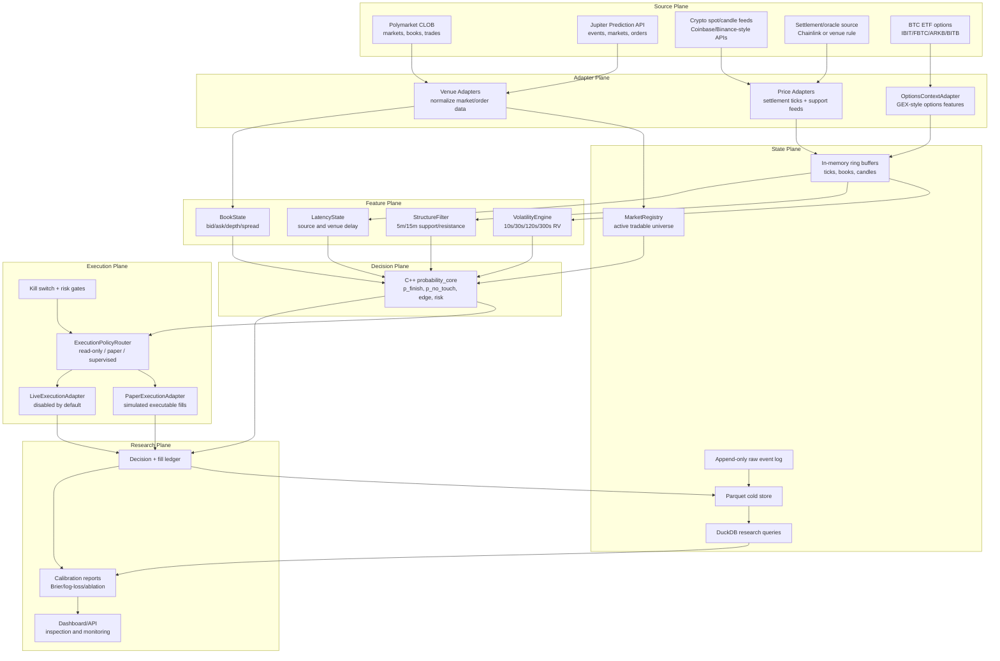
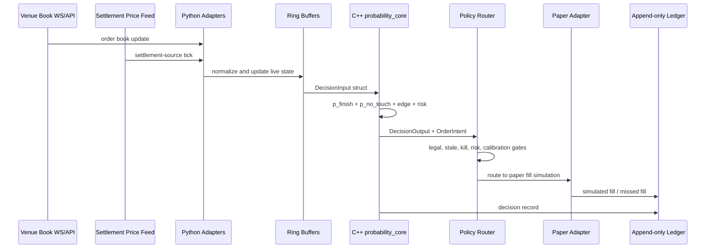
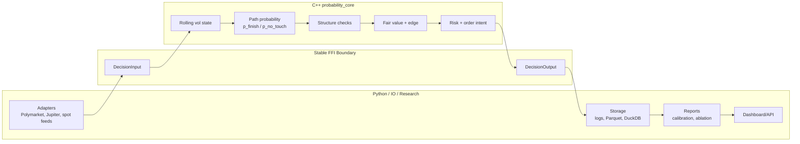
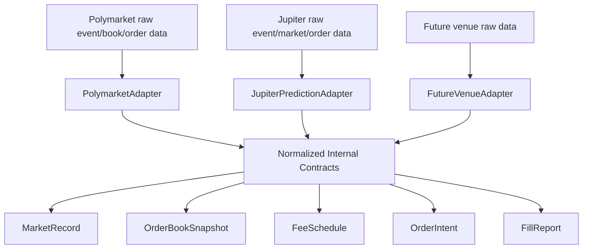
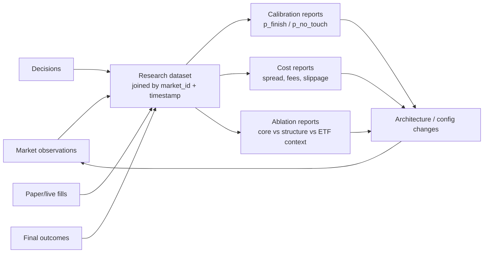
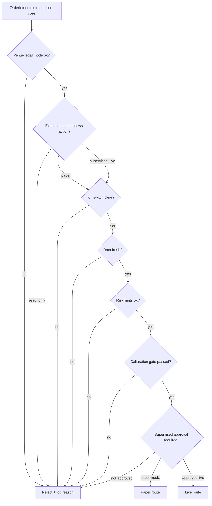

# Architecture Visualization

Date: 2026-05-28

These diagrams are editable Mermaid blocks. Obsidian, GitHub, and many Markdown
viewers can render them directly.

## Full System Map

## Hot Decision Loop

## Compiled Core Boundary

## Venue Adapter Normalization

## Research Feedback Loop

## Execution Safety Gates

